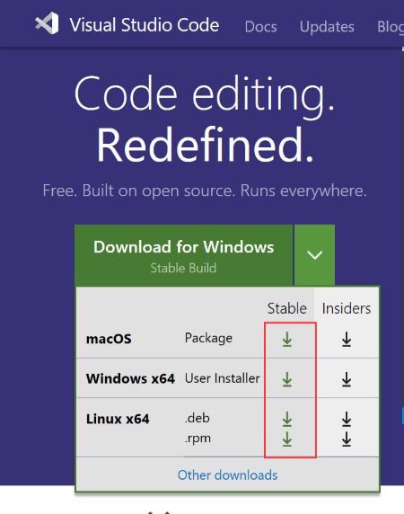

# MicroPython-Samples [](./LICENSE)

Provide many interesting micro python code for bpi:bit

为 bpi:bit 提供许多有意思的Python代码示例。

## 文件目录:

```

MicroPython-Samples
│  .gitignore
│  boot.py
│  LICENSE
│  list.txt
│  main.py
│  README.md
│  webdav.json
│  wifi_cfg.py
│  
├─.vscode
│  settings.json
│      
├─00.basics
│      globals.py
│      helloworld.py
│      
├─01.leds
│      blink.py
│      blink_toggle.py
│      blink_without_delay.py
│      fade.py
│      heartbeat.py
│      heartbeat_fade.py
│      pixel.py
│      rgb_lattice.py
│      
├─02.inputs
│      adc.py
│      button.py
│      potentiometer.py
│      serial.py
│      switch_neopixel.py
│      trigger.py
│      uart.py
│      
├─03.pins
│      pins_basic_output.py
│      
├─04.i2c
│      i2c-scan.py
│      pca9685.py
│      RTC-PCF8563.py
│      
├─05.spi
│      font.py
│      index.py
│      st7735.py
│      tft.py
│      
├─06.clock
│      clock.py
│      set_time.py
│      
├─07.sensors
│  │  dht11.py
│  │  sh1106.py
│  │  ssd1306.py
│  │  
│  ├─buzzer
│  │      radombuzzer.py
│  │      
│  ├─cs5460a
│  │      cs5460a.py
│  │      
│  ├─dht
│  │      dht11.py
│  │      
│  ├─hc-sr04
│  │      hc-sr04.py
│  │      
│  ├─M5310A
│  │      M5310A.py
│  │      M5310A_old.py
│  │      
│  ├─mpu9250
│  │      ak8963.py
│  │      exmaple.py
│  │      mpu6500.py
│  │      Mpu9250.py
│  │      
│  └─ptsmd021
│          lumtoled.py
│          
├─08.servos
│      get_servo_angle.py
│      sweep.py
│      
├─09.scratch
│      firmata.py
│      s4a.py
│      
├─10.microbit
│      accelerometer.py
│      button.py
│      compass.py
│      display.py
│      light.py
│      microbit.py
│      music.py
│      pins.py
│      s2mb.py
│      temperature.py
│      
├─11.app
│      artec.py
│      balance_ball.py
│      ble.py
│      bpi_car.py
│      car.py
│      hardware_test.py
│      http_crawler.py
│      motor.py
│      ovo_robot.py
│      repl_to_uart.py
│      snake_move.py
│      spiral_led.py
│      zhiwu_idas.py
│      
├─12.network
│      ftp_server.py
│      get_weather.py
│      mdns_server.py
│      server_base.py
│      server_mqtt.py
│      tcp_server_poll.py
│      udp_client.py
│      webdav_server.py
│      wifi.py
│      XAsyncSockets.py
│      zhiwu.py
│      zw_tran.py
│      
├─13.system
│      logging.py
│      task.py
│      timer.py
│      watchdog.py
│      yield.py
│      yield_task.py
│      
├─14.music
│      music.py
│      music_bulid_in.py
│      music_esp32.py
│      
└─15.algorithm
        crc16.py

```      

## 快速使用 micropython-samples

### vscode

我们使用vscode这个IDE来编写运行代码，直接到官方下载安装 
- 进入   https://code.visualstudio.com   选择适合电脑的版本安装

### python安装

- python的版本要选择在3.5及以上的版本
- 安装的时候选择安装pip

### 串口驱动安装

bpi:bit板使用的是ch340这块芯片，电脑上要安装相关的驱动

- [点击下载ch340驱动](http://www.wch.cn/downloads/file/65.html)
  下载完后安装即可

### mpfshell

- 下载安装
mpfshell需要安装两个，一个使用python pip安装在系统环境中，一个在vscode的商店中安装mpfshell插件。

vscode有很多插件可以使用，这里我们直接到商店中搜索 mpfshell 后安装，要使用mpfshell需要确保电脑已经安装了python3 并已经把python3添加到环境变量中。

- 使用
  使用usb线连接板子，然后用vscode打开我们的micropython-samples这个文件夹，在此之前需要我们把这个项目clone下来或者下载文件压缩包。然后找到我们想要运行的文件，双击打开，在内容编辑区使用鼠标右键，选择mpfs>run this file就可以直接在板子上面运行文件了，同时也可以使用start repl、open tool。都是右键选中直接运行命令。

### 要处理的效果

第一、安装工具相关的链接，文档链接

第二，安装 VSC 的一步步方法和教程，注意我的自动化部署工具， Python3.5 同理

第三，一个从下载说明、使用示例、运行代码的过程示例。

每个事情都可以单拆成文档


