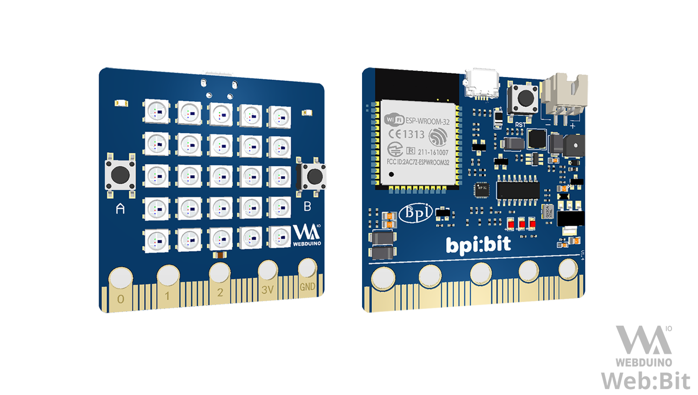

# MicroPython-Samples [](./LICENSE)

Provide many interesting Micro Python Code for bpi:bit(esp32).

为 bpi:bit(esp32) 提供许多有意思的 Python 代码示例。



## Getting Started

- [安装有线驱动](https://bpi-steam-docs.readthedocs.io/zh_CN/latest/bpi-steam/driver.html)

- [烧录开发固件](https://doc.bpi-steam.com/zh_CN/latest/micropython/tutorials/flash_mpy.html)

- [搭建开发环境](readme/build.md)
  
- [新手入门示例](readme/example.md)

- [常见问题解答](readme/FAQ.md)

## 示例代码分类

> 2019年7月18日：未来将会对基础示例代码进行更有现实意义的分类。
> 补配合文档的分类。

```txt

MicroPython-Samples
│  .gitignore
│  boot.py
│  LICENSE
│  list.txt
│  main.py
│  README.md
│  webdav.json
│  wifi_cfg.py
│  
├─.vscode
│  settings.json
│
├─00.basics
│      globals.py
│      helloworld.py
│
├─01.leds
│      blink.py
│      blink_toggle.py
│      blink_without_delay.py
│      fade.py
│      heartbeat.py
│      heartbeat_fade.py
│      pixel.py
│      rgb_lattice.py
│
├─02.inputs
│      adc.py
│      button.py
│      potentiometer.py
│      serial.py
│      switch_neopixel.py
│      trigger.py
│      uart.py
│
├─03.pins
│      pins_basic_output.py
│
├─04.i2c
│      i2c-scan.py
│      pca9685.py
│      RTC-PCF8563.py
│
├─05.spi
│      font.py
│      index.py
│      st7735.py
│      tft.py
│
├─06.clock
│      clock.py
│      set_time.py
│
├─07.sensors
│  │  dht11.py
│  │  sh1106.py
│  │  ssd1306.py
│  │  
│  ├─buzzer
│  │      radombuzzer.py
│  │
│  ├─cs5460a
│  │      cs5460a.py
│  │
│  ├─dht
│  │      dht11.py
│  │
│  ├─hc-sr04
│  │      hc-sr04.py
│  │
│  ├─M5310A
│  │      M5310A.py
│  │      M5310A_old.py
│  │
│  ├─mpu9250
│  │      ak8963.py
│  │      exmaple.py
│  │      mpu6500.py
│  │      Mpu9250.py
│  │
│  └─ptsmd021
│          lumtoled.py
│
├─08.servos
│      get_servo_angle.py
│      sweep.py
│
├─09.scratch
│      firmata.py
│      s4a.py
│
├─10.microbit
│      accelerometer.py
│      button.py
│      compass.py
│      display.py
│      light.py
│      microbit.py
│      music.py
│      pins.py
│      s2mb.py
│      temperature.py
│
├─11.app
│      artec.py
│      balance_ball.py
│      ble.py
│      bpi_car.py
│      car.py
│      hardware_test.py
│      http_crawler.py
│      motor.py
│      ovo_robot.py
│      repl_to_uart.py
│      snake_move.py
│      spiral_led.py
│      zhiwu_idas.py
│
├─12.network
│      ftp_server.py
│      get_weather.py
│      mdns_server.py
│      server_base.py
│      server_mqtt.py
│      tcp_server_poll.py
│      udp_client.py
│      webdav_server.py
│      wifi.py
│      XAsyncSockets.py
│      zhiwu.py
│      zw_tran.py
│
├─13.system
│      logging.py
│      task.py
│      timer.py
│      watchdog.py
│      yield.py
│      yield_task.py
│
├─14.music
│      music.py
│      music_bulid_in.py
│      music_esp32.py
│
└─15.algorithm
        crc16.py

```
