# 使用 MicroPython Samples 仓库

如下使用的效果，你需要安装 Python3 和 VSCODE 编辑器。

图示

## 一键部署

测试环境 window7 +

下载链接
稍后传到 release 备份一份。

使用教程
http://www.i5seo.com/python-vscode-one-click-installation-windows-mac-version.html

## 手动安装

当你一键部署失败了，可以参考手动安装教程。

### 安装 PYTHON3 

可以参考该篇文档，<https://www.runoob.com/python3/python3-install.html。>

或使用以下图示教程。

#### 下载 python

到官方的网站上下载python https://www.python.org/

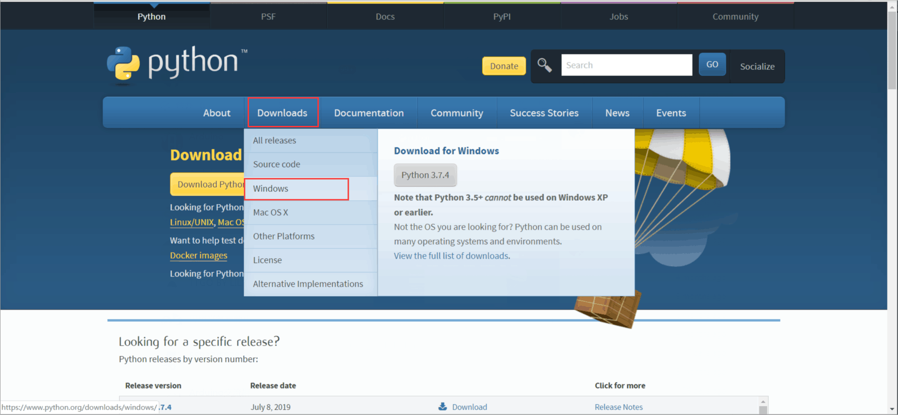

进去官网，在download下面选择你电脑的系统，这里以windows为例。

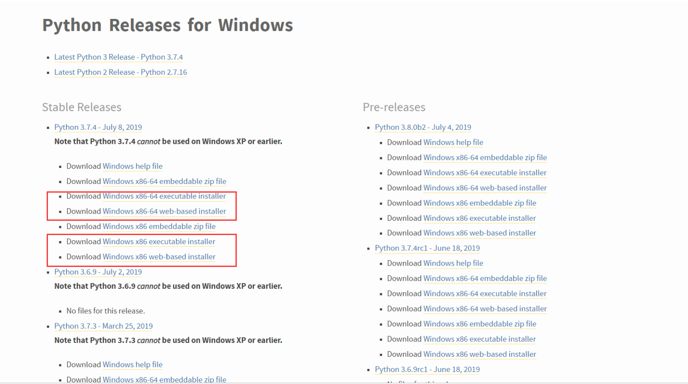

这里要选择相应的版本，python要选择3.5及以上的版本，注意如果电脑是64位的就选x86-64的下载，电脑是32位的就选择x86的下载，这里的安装包一种是web-base，一种是executable的，选择哪种都是可以的。

#### 安装python

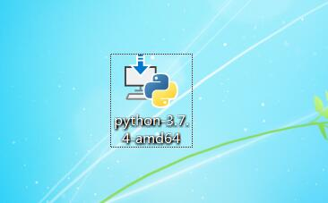

下载得到安装包双击运行

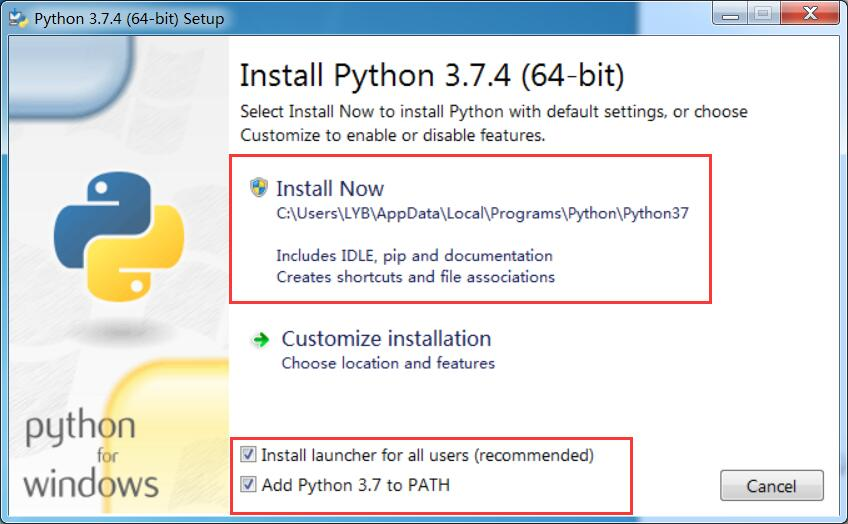
这里要勾选 Add Python to Path ,然后选择install Now 自动安装

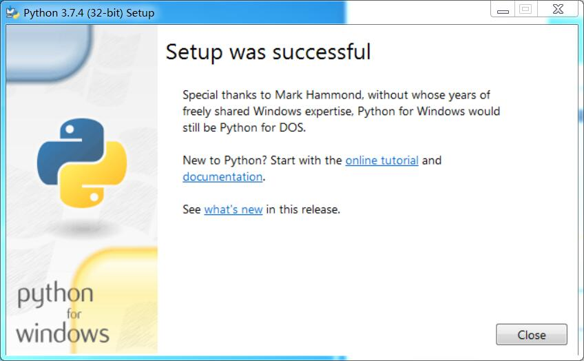
完成安装

### 安装 VSCODE

可以参考以下两篇，或百度：如何安装 VSCODE。

<https://jingyan.baidu.com/article/d3b74d640eadce1f76e60958.html>

<https://www.jb51.net/article/151655.htm>

或使用以下图示教程。

#### 安装vscode

首先下载软件 <https://code.visualstudio.com/>

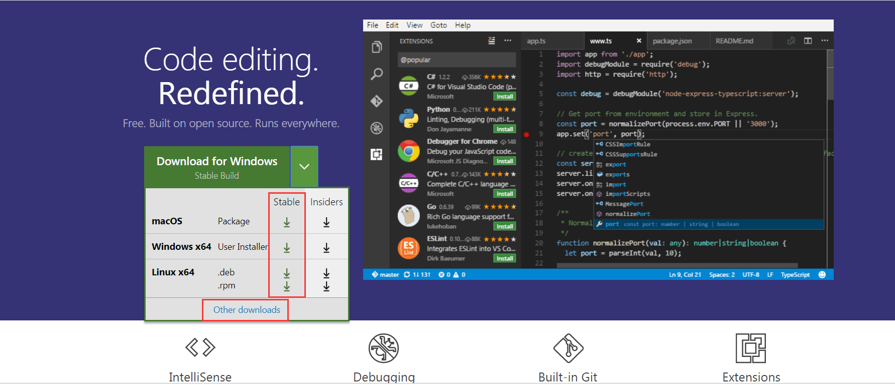

点击直接下载，如果上面三个瞎下载选项没有你电脑的类型就点击other download。

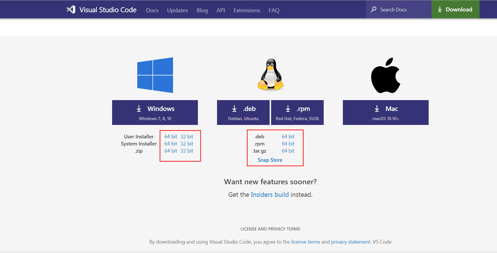

选择相应的系统版本直接下载安装文件。

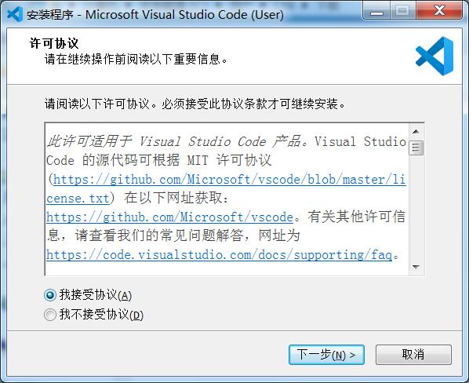

找到下载的文件并打开

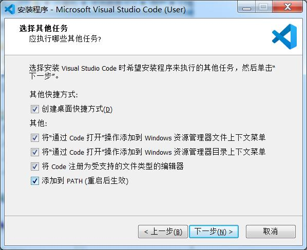
这里最好是全部勾选上方便使用

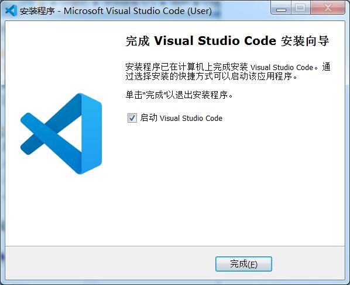

完成安装

### 设置

下载安装完成vscode和python后需要进行一些简单的设置。

#### 安装mpfshell

首先要打开命令窗口，键盘win+r，输入cmd后回车打开

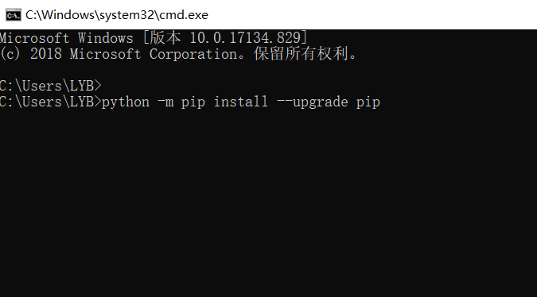

输入 python -m pip install --upgrade pip 更新pip

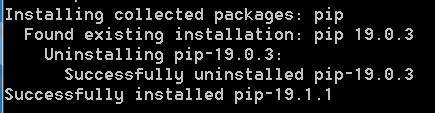

成功更新pip

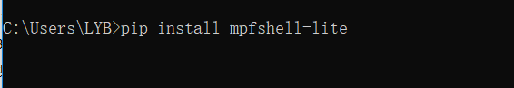

输入 pip install mpfshell-lite 安装mpfshell-lite

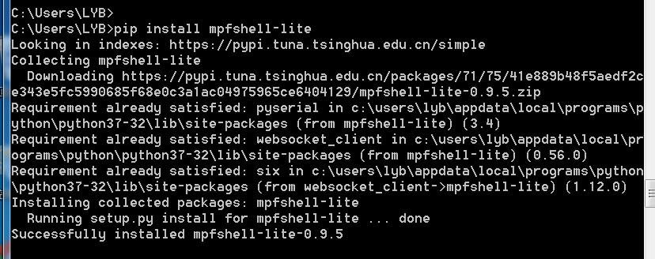

成功安装mpfshell-lite

#### 安装 VSCODE python插件

进入商店搜索 python 选择下载即可
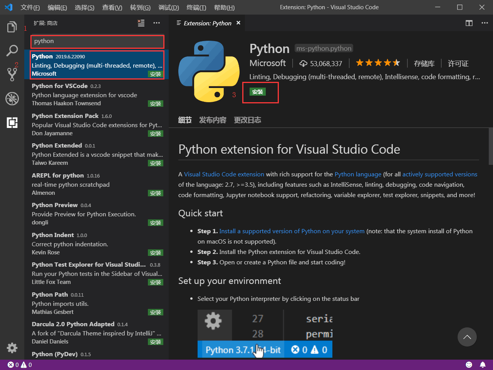

#### 安装 VSCODE mpfshell插件

进入商店搜索 Mpfshell 选择下载即可
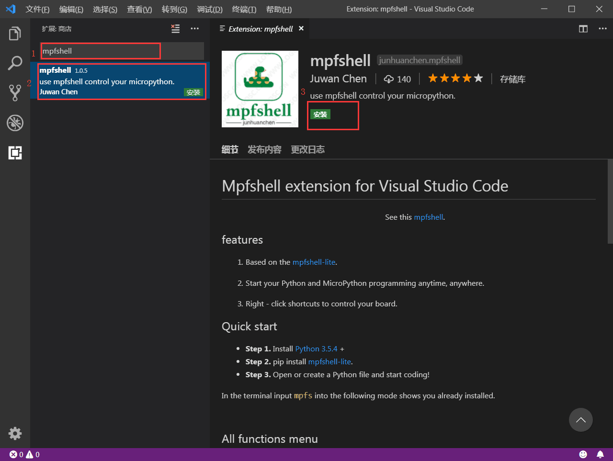

#### 安装 VSCODE 中文语言包插件

进入商店搜索 Chinese 选择下载即可

### 如何开始使用

下载文件夹

右键菜单打开文件夹

选择一个代码，右键选择运行

在该文件夹，第一次使用会提示输入串口配置，填空自动搜索，配置文件存储在 .vscode/

可以运行查看效果，如果需要指定串口需要使用菜单 

修改成你知道的设备串口即可。
运行示例代码请看 此文档。
