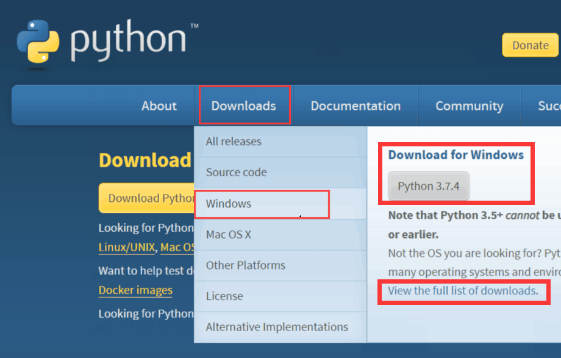

# 使用 MicroPython Samples 仓库

需要安装 Python3 、 VSCode 、 Mpfshell-lite 呈现如下使用效果。

## 安装 CH340 串口驱动

BPI-BIT 连接电脑的时候会提示你安装驱动，如果需要有线连接开发程序，则可以查看[安装驱动教程](https://bpi-steam-docs.readthedocs.io/zh_CN/latest/bpi-steam/driver.html) 完成安装。

## 一键部署

> 测试环境 window7 + 家庭基础版

[更新日志 & 下载链接](https://github.com/BPI-STEAM/One-click-micropython-deployment/releases)

- [使用教程（一）](https://github.com/BPI-STEAM/One-click-micropython-deployment)

- [使用教程（二）](http://www.i5seo.com/python-vscode-one-click-installation-windows-mac-version.html)

## 手动安装

若是一键部署失败了，可以参考以下教程手动安装。

### 如何安装 Python3 环境

[可以参考该篇文档](https://www.runoob.com/python3/python3-install.html>) 或根据以下图示教程，切记一定要添加环境变量。

#### 下载 & 安装 Python3

进入 [Python3](https://www.python.org) 官网，在 Download 下面选择适合你电脑系统的版本，这里以 Windows 为例。

进入下载页面，选择 3.5 及以上的 Python 版本，并建议选择 32 位的 x86 版本，安装包选择 executable installer 直接下载好后安装的版本。

下载得到 Python 安装包后双击运行。

勾选 `Add Python to Path` （添加环境变量），接着选择 `install Now` 自动等待安装完成。

安装完成如下图。

### 如何安装 VSCode IDE

百度搜索 `如何安装 VSCODE` 或参考以下两篇教程进行安装。

- [VSCode的下载和安装](https://jingyan.baidu.com/article/d3b74d640eadce1f76e60958.html)

- [vsCode安装使用教程和插件安装方法](https://www.jb51.net/article/151655.htm)

你也可以跟着以下图示教程直接开始。

#### 下载 & 安装 VSCode

进入[VSCode 官网](https://code.visualstudio.com/) 点击 `Download for Windows` 就会直接下载。

若是下载选项没有适合你电脑的版本就请点击 `other download` ，可以在该页选择你想要的版本。

选择与你电脑对应的系统版本（Windows 建议 32位 X86 版本），下载并运行安装程序。

全部勾选以下功能选项有利于你快速使用 VSCode 如点击文件夹后右键打开 VSCode （Open with Code）。

如下图完成安装。

### 配置 MicroPyhton 开发环境

安装 VSCode 和 Python3 后，你还需要进行一些额外的配置。

#### 安装 mpfshell-lite

[开源仓库 & 使用说明](https://github.com/BPI-STEAM/mpfshell-lite)

首先在键盘上按下组合键 win + r 打开命令窗口，输入 cmd 后按回车打开命令行控制台。

输入 `python -m pip install --upgrade pip` 开始更新 pip ，如果你不想要更新可以跳过该操作。

成功更新 pip 接着输入 `pip install mpfshell-lite` 安装 mpfshell-lite

成功安装 mpfshell-lite ，输入 mpfs 确认配置成功。

#### 安装 VSCODE Python 插件

进入商店搜索 python 选择下载即可

#### 安装 VSCODE mpfshell 插件

进入商店搜索 Mpfshell 选择下载即可

#### 安装 VSCODE 中文语言包 插件

进入商店搜索 Chinese 选择下载即可

## 至此安装教程已经完成，可以查看[如何开始使用一个示例代码](example.md)。
