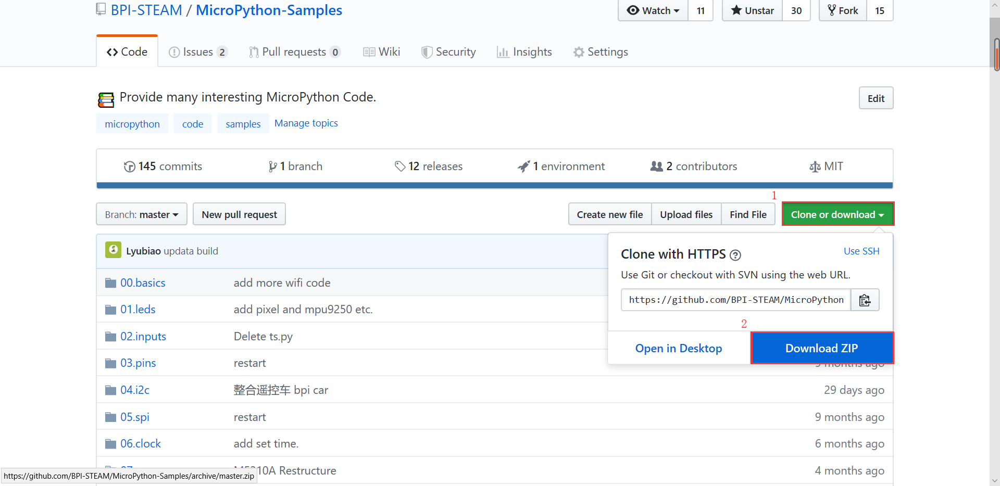
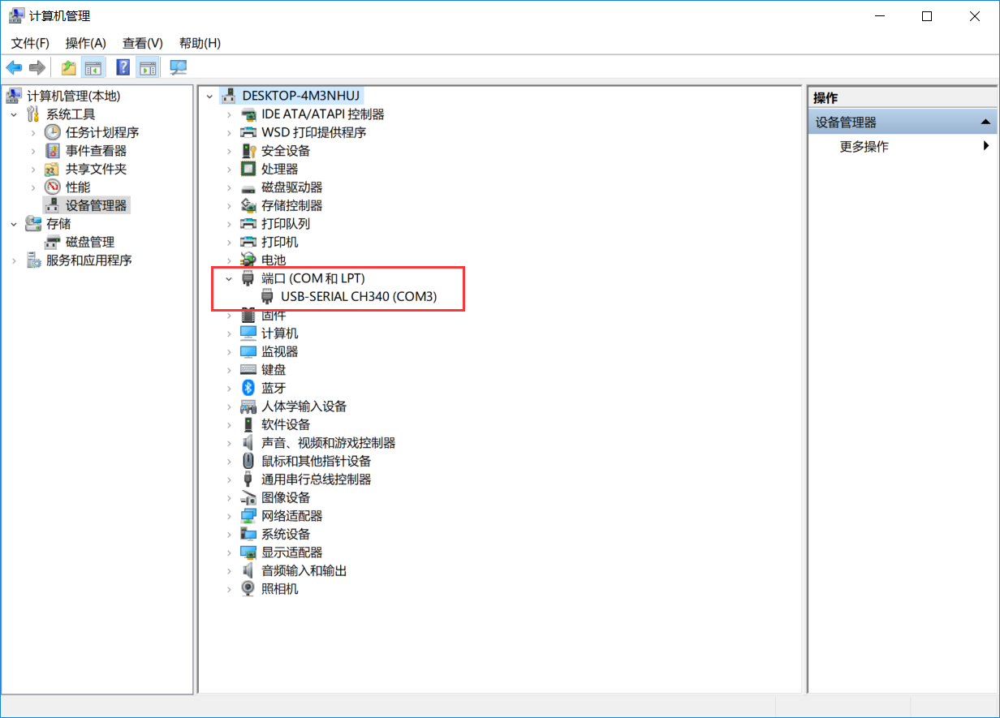
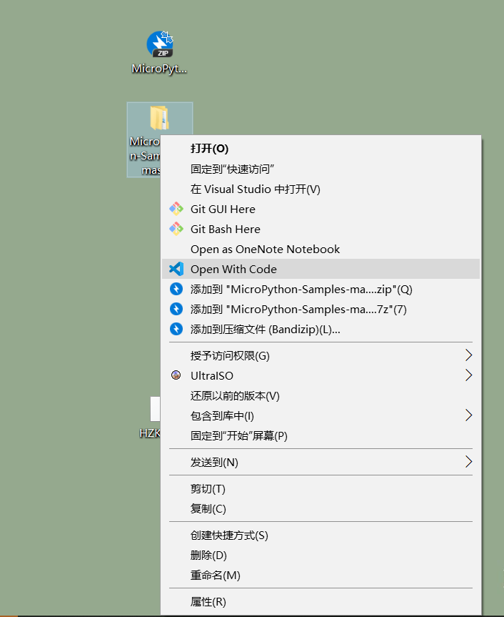
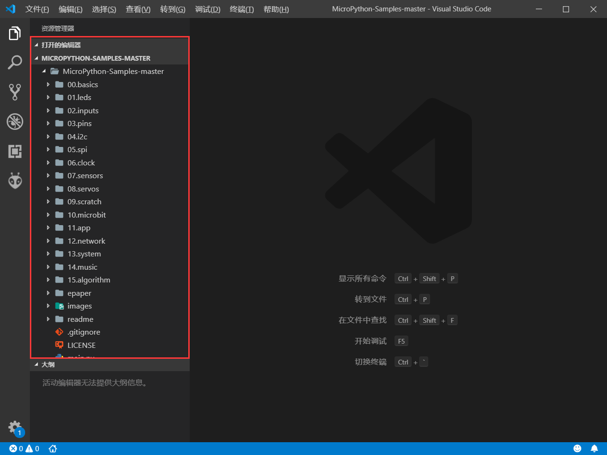
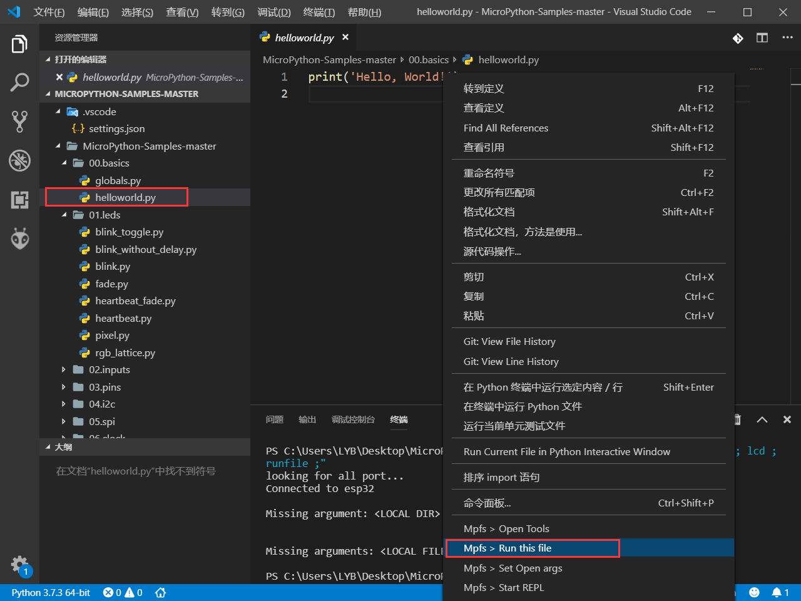
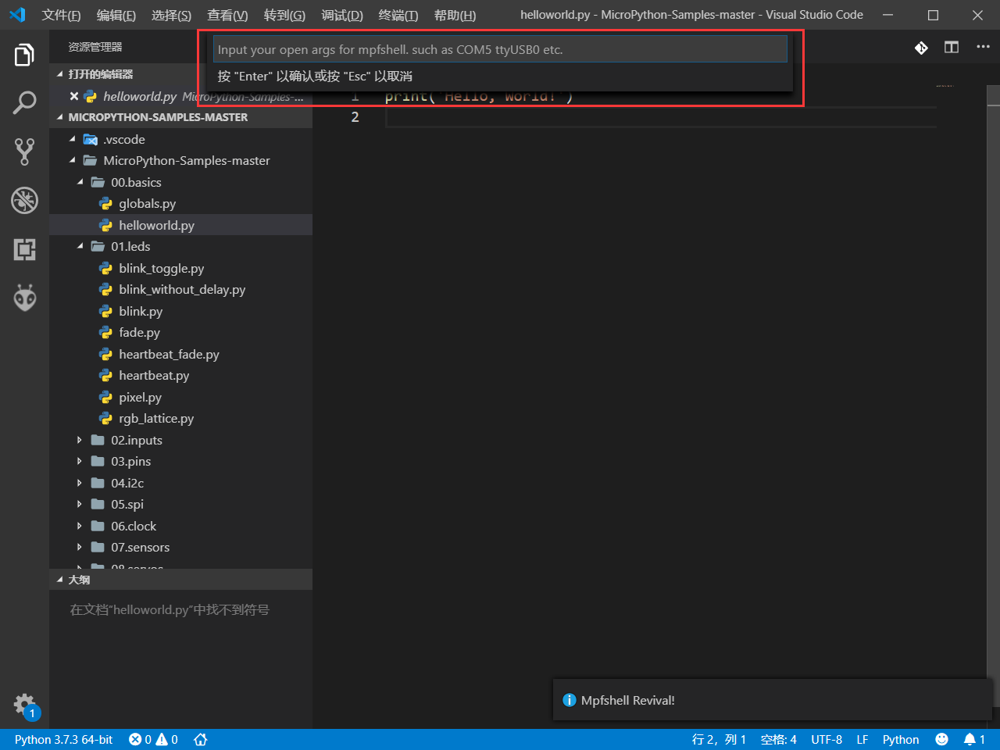
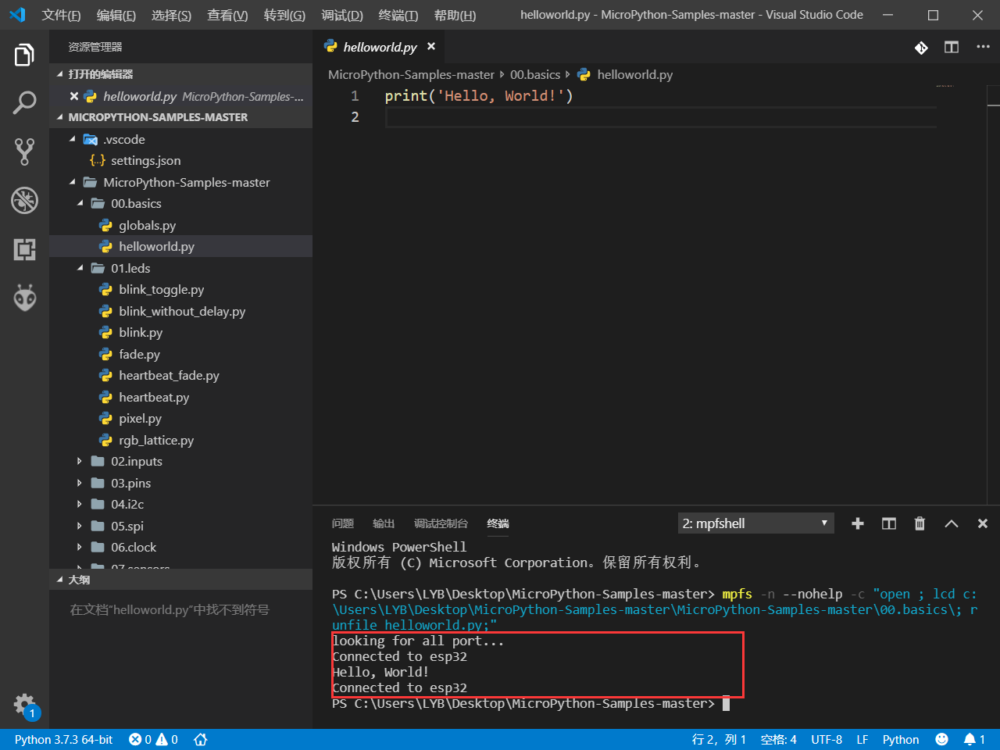

# 如何使用仓库的 MicroPython 代码

## 下载sample示例代码包

### 方式一

进入github仓库 <https://github.com/BPI-STEAMMicroPython-Samples> 下载代码包

点击 clone or download 后选择download zip 下载压缩包

### 方式二

如果电脑上有安装git工具可以直接运行下面命令clone下来就可以了
```git clone https://github.com/BPI-STEAM/MicroPython-Samples```

## 运行sample示例代码

### 连接板子

使用usb线连接电脑和bit板，如果在设备管理器中查找到相应的串口设备，即表示连接成功。


### 用vscode打开文件

解压我们下载得到的压缩包，右键选择用vscode打开



在右侧的文件编辑区可以看到我们的sample库



我们以helloworld.py为例演示下如何运行示例代码,首先双击打开 [helloworld.py](https://github.com/BPI-STEAM/MicroPython-Samples/blob/master/00.basics/helloworld.py),然后在代码区右键选择run this file 即可运行这个代码。


如果是第一次使用sample库就需要设置一下使用的串口号，点击润this file后会提示输入使用的串口号，这一步需要输入对应的com口，比如'com3','com4'。这一步不是必要的可以选择跳过如果没有设定com口，mpfshell会自动搜索可用的com口。


成功运行程序得到结果。

