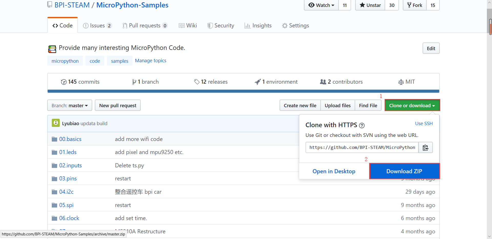
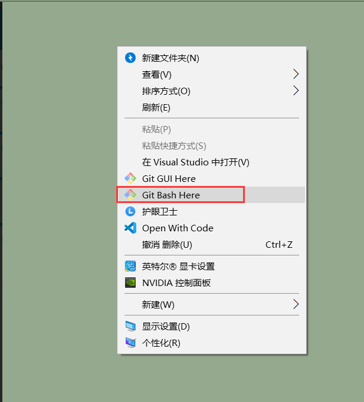
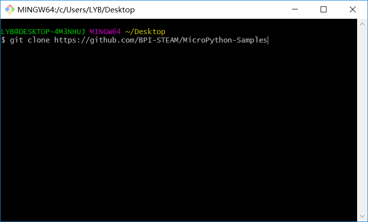
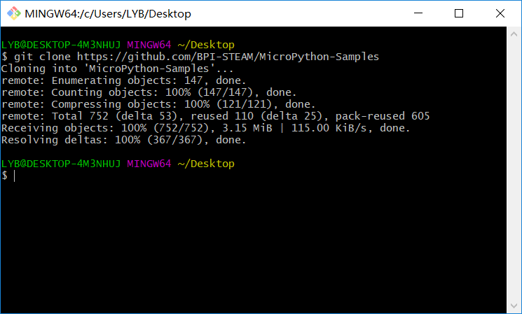
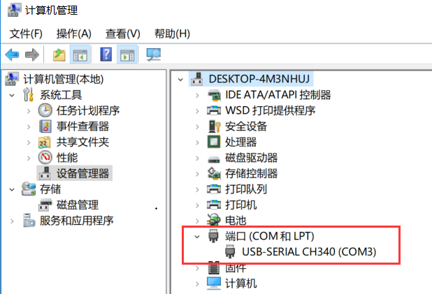
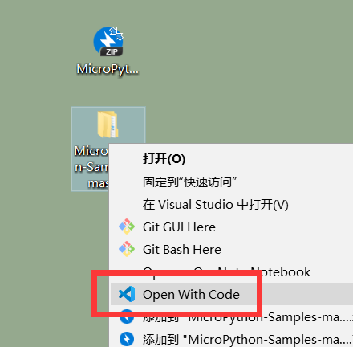
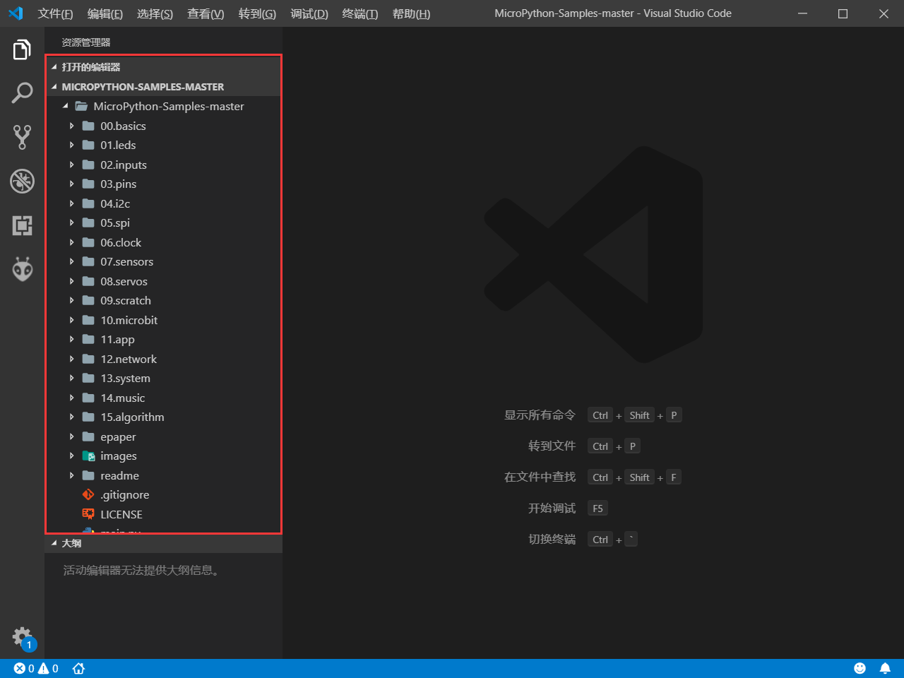
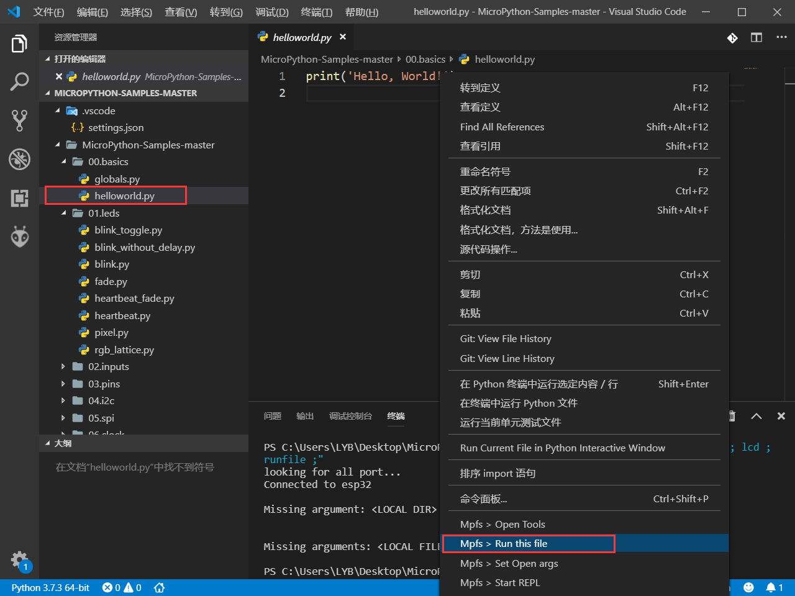
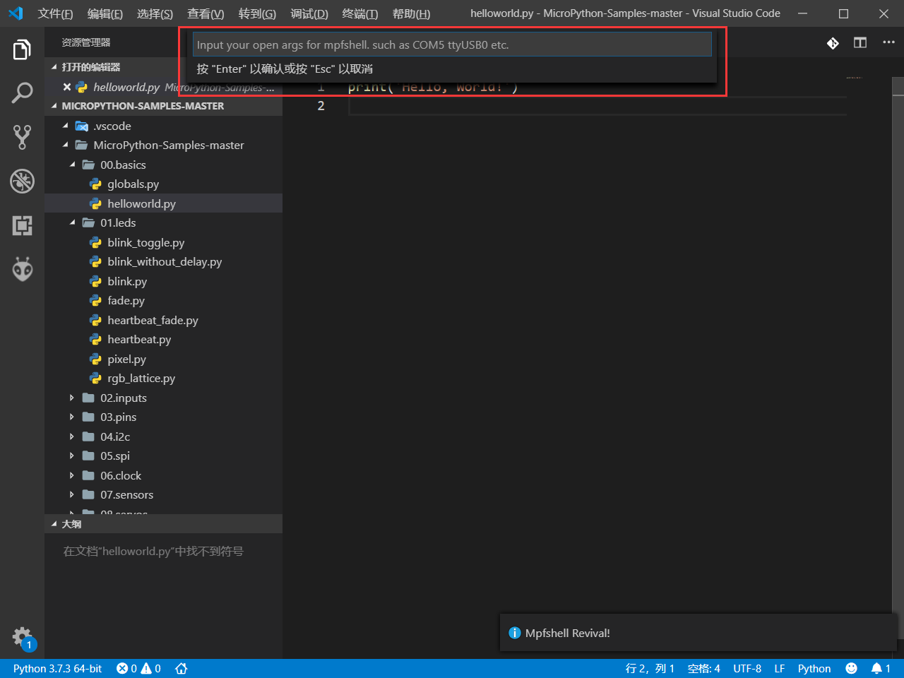
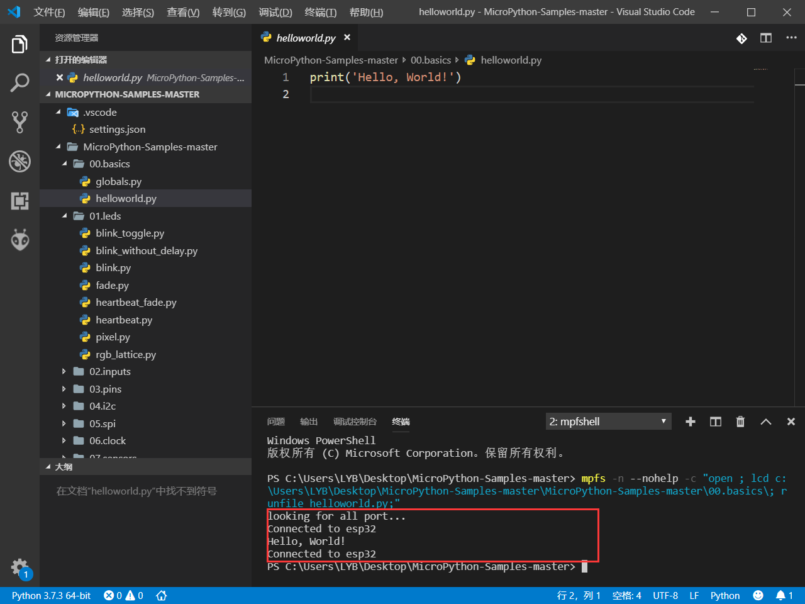

# 使用本仓库的 MicroPython 代码

## 下载 Sample 示例代码

### 方式（一）

进入 [MicroPython-Samples](https://github.com/BPI-STEAM/MicroPython-Samples) 仓库下载代码包，点击 `clone or download` 后选择 `download zip` 下载压缩包。

### 方式（二）

若是电脑有安装 git 工具，可以使用 git 工具把 `MicroPython-Samples` 库 `clone` 下来。

如下图在指定的文件夹中右键选择 `Git Bash Hear`。

输入 `git clone https://github.com/BPI-STEAM/MicroPython-Samples` 到命令行提示符窗口。

按下回车键开始 `clone` ，完成后 `MicroPython-Samples` 库就会出现在当前文件夹中。

## 运行 Sample 示例代码

> 在这之前请先配置好 MicroPython [开发环境](build.md)。

### 连接板子

确保你已经为板子烧入 MicroPython 固件，使用 USB 线连接电脑和 BPI-BIT 板，在设备管理器中查找到对应的串口设备，即表示连接成功。

### 用 VSCode 打开文件夹

解压刚才下载得到的压缩包（MicroPython-Samples），右键选择用 VSCode 打开。

在右侧的文件编辑区可以看到我们的 MicroPython-Samples 库

这里以 helloworld.py 为例演示下如何运行示例代码，首先双击打开 [helloworld.py](https://github.com/BPI-STEAM/MicroPython-Samples/blob/master/00.basics/helloworld.py) ，然后在 **代码区** 右键出现菜单，并在最底下选择 `run this file` 菜单即可运行当前这个代码区的文件代码。

第一次使用 mpfshell 插件就需要设置一下对应使用的串口号，点击 run this file 后会提示输入使用的串口号，这一步需要输入对应的 com 口，比如 'com3'、'com4'。这一步不是必要的可以选择跳过，如果没有设定 com 口（填空）后 mpfshell 就会自动搜索可用的 com 口。

成功运行程序得到结果。

